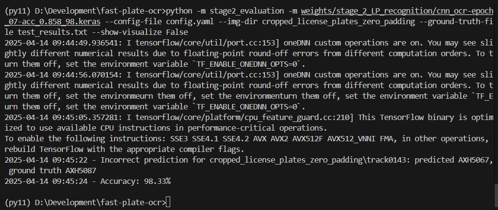
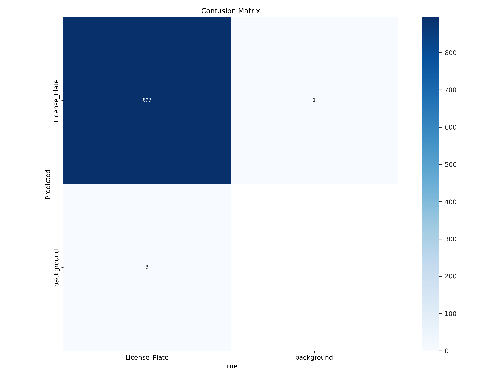
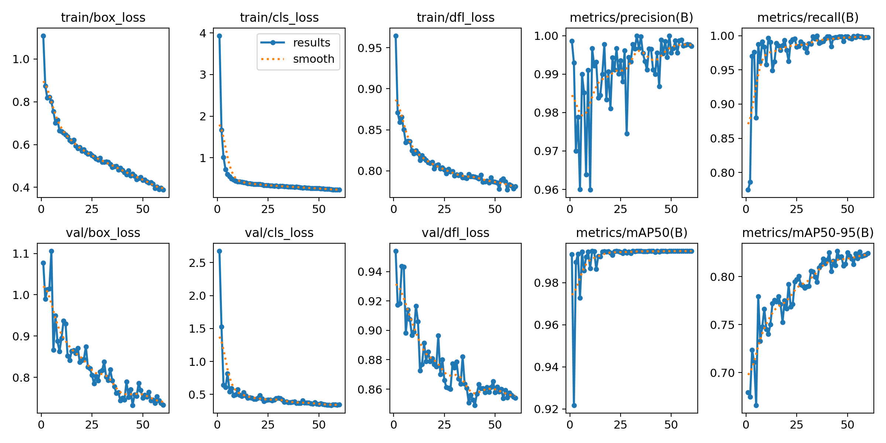
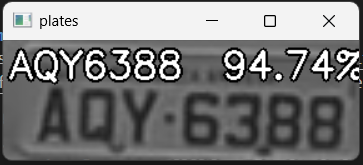
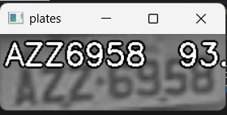
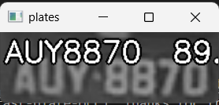
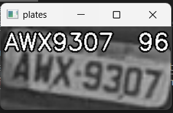

<div align="center">
<h3>DEVELOPMENT OF AUTOMATIC LICENSE PLATE RECOGNITION ON RASPBERRY PI 5 USING YOLO V11 AND MOBILEVITV2</h3>
</div>

## Environment
Mostly you will need these packages to work:
- tensorflow
- opencv-python
- onnxruntime
- pydantic
- PyYAML
- tqdm
- click

or use requirement file:
```
pip install -r requirements.txt
```

## PREDICTION
download test_tracks: https://drive.google.com/file/d/1Y1emehE8KL3nzFuwWvTWv5JYc9aYMqIK/view?usp=sharing

To re-produce the results for stage 2
```
python -m stage2_evaluation -m weights/stage_2_LP_recognition/cnn_ocr-epoch_07-acc_0.858_98.keras --config-file config.yaml --img-dir cropped_license_plates_zero_padding --ground-truth-file test_results.txt --show-visualize False
```



## TRAINING
To train stage 2, LP recognition, please use stage_2_licesne_plate_recognition.ipynb in notebook folder
You will need below files to train the model, these files are provided in the repo at:
- base_model.keras in weights/stage_2_LP_recognition folder
- config.yaml

## RESULTS

Some results for stage 1:



More details in: results/stage_1_LP_detection/

Some results for stage 2:





## Acknowledgement
This project is based on [fast-plate-ocr](https://github.com/ankandrew/fast-plate-ocr), Thanks for their excellent work!

