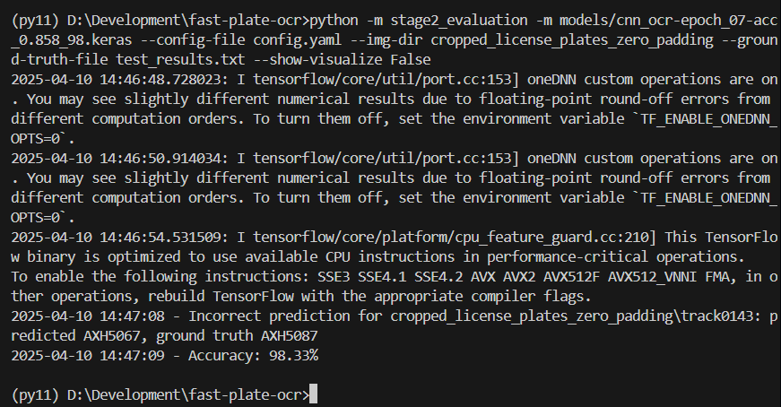

To re-produce the results for stage 2

python -m stage2_evaluation -m models/cnn_ocr-epoch_07-acc_0.858_98.keras --config-file config.yaml --img-dir cropped_license_plates_zero_padding --ground-truth-file test_results.txt --show-visualize False

## Environment
- tensorflow
- opencv-python
- onnxruntime
- pydantic
- PyYAML
- tqdm
- click

